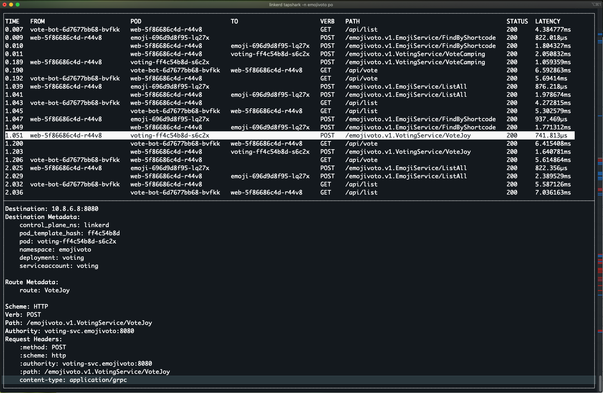

# tapshark

A wireshark inspired ncurses-style command line interface for Linkerd tap.



## Requirements

Requires [Linkerd 2.10.0](https://github.com/linkerd/linkerd2/releases/tag/stable-2.10.0)
with the [Viz extension](https://linkerd.io/2.10/getting-started/) installed.

## Building

1. Build linkerd-tapshark: `go build -o linkerd-tapshark ./main.go`
1. Move the binary onto your PATH: `mv linkerd-tapshark ~/.linkerd2/bin/`

## Usage

```
linkerd tapshark
```

Tapshark accepts the same flags as [linkerd tap](https://linkerd.io/2.10/reference/cli/viz/index.html#tap).

Use the arrow keys the browse requests.  Press enter to see details for the
selected request.  Press tab to switch focus between the top and bottom pane.
Ctrl-c to exit.
